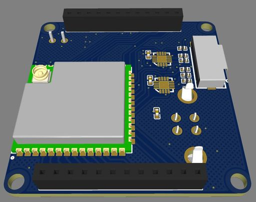

# Open Night Sky Cam
## Features
* Based On ESP32-S3-Wroom-1 Module with 8MB Flash and 8MB PSRAM
* Long Exposure Time
* TF card supported by SDMMC 
* U-Disk Mode, USB 2.0 HighSpeed Write and Read Files
* C-Mount, also Support M12 Lens and 1.25 Inch Telescope Mount with adapter
* USB Serial Mode

## Architecture

## PCB
* Main PCB Project: https://oshwlab.com/flashindream/opennightskycam
* Sensor PCB Project: https://oshwlab.com/flashindream/ar0130-dvp

## Mechanical

## Firmware
* install VSCode and Platformio
* download and open the firmware source code by VSCode
* copy the "esp32-s3-wroom-1.json" to ~/.platformio/platforms/espressif32/boards
* compile the code
* build and upload the filesystem image for web

## How To Use
* plug in USB cable to the cam.
* connect "Night-Sky" ssid without password by WiFi
* open http://192.168.43.1/index.html on your browser
* close the U-DISK mode on Setting tab
* then preview it 