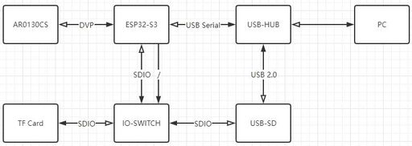

# Open Night Sky Cam
## Features
* Long Exposure Time
* TF card supported by SDMMC 
* U-Disk Mode, USB 2.0 HighSpeed Write and Read Files
* C-Mount, also Support M12 Lens and 1.25 Inch Telescope Mount with adapter
* USB Serial Mode

## Architecture

## PCB

## Mechanical

## Firmware

## How To Use